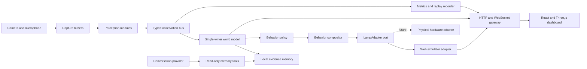
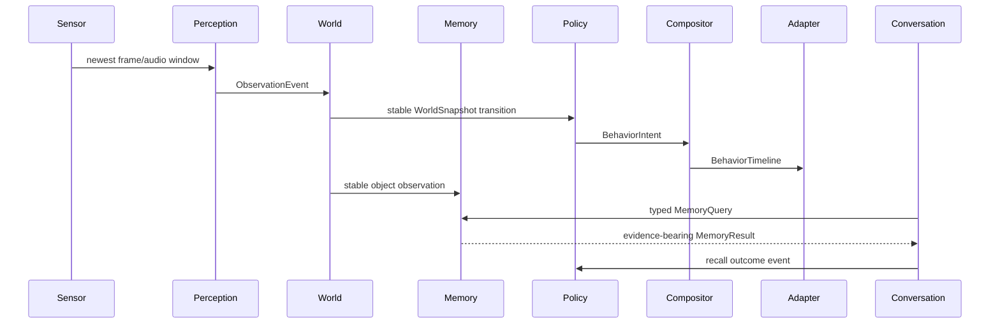

# Overall System Design

## Purpose

The system demonstrates an expressive lamp that observes a room through a webcam and microphone, estimates human engagement, reacts through a simulated six-degree-of-freedom lamp, remembers objects, and answers questions from stored evidence. It must remain useful without network access and allow a future physical lamp to replace the simulator without changing perception, memory, or behavior policy.

## Success Criteria

The four required scenarios are release-blocking. Bonus capabilities are included behind feature flags and may ship only when they do not reduce core reliability. Quantitative gates are defined in the evaluation specification.

## Runtime Topology

The product has two deployable applications:

1. A Python 3.12 modular monolith running FastAPI, sensor ingestion, perception, world state, memory, behavior, conversation adapters, telemetry, and a WebSocket gateway.
2. A React/TypeScript client using Three.js through React Three Fiber for the lamp simulator and operational dashboard.

SQLite and snapshots are local files. Cloud access is limited to the configured conversation provider. The server continues with typed queries and deterministic answer templates if cloud access fails.

## Two-Loop Architecture

### Fast perception loop

- Capture only the most recent camera frame.
- Run face, head-pose, gaze, common-object, and audio analysis at component-specific rates.
- Publish typed observations with confidence and timing.
- Target 15-30 camera iterations per second without accumulating stale frames.

### Deliberative event loop

- Convert observations into stable people, objects, engagement, audio, and health state.
- Persist stable object observations and derived last-known state.
- Select behavior intent from stable state and recent history.
- Compose synchronized motion, light, and sound timelines.
- Answer memory questions through constrained retrieval tools.

Slow open-vocabulary enrichment and cloud calls run in bounded workers. Neither may block the fast loop.

## Module Boundaries

| Module | Owns | Must not own |
| --- | --- | --- |
| Capture | Camera/audio acquisition and frame references | Interpretation or policy |
| Perception | Stateless or short-window evidence extraction | Stable world state or output commands |
| World model | Stable session entities, engagement, audio mode, health | Database persistence or rendering |
| Memory | Observation persistence and deterministic retrieval | Conversational phrasing |
| Behavior policy | Selection of semantic intent | Joint values or device calls |
| Compositor | Priority, cancellation, and output timelines | Social-state decisions |
| Conversation | Speech/text transport and grounded phrasing | Arbitrary SQL or observation writes |
| Adapter | Capability mapping and output execution | Behavior selection |
| API gateway | HTTP/WebSocket contracts and operator commands | Duplicate domain state |
| Observability | Traces, metrics, replay, and faults | Recovery policy outside declared commands |

## Social and Audio State

`social_state` is one of `idle`, `candidate`, `engaged`, `disengaged`, or `seeking_attention`. `audio_mode` is orthogonal and is one of `silent`, `listening`, `thinking`, or `speaking`.

- `idle -> candidate` when attention evidence becomes plausible.
- `candidate -> engaged` after the entry threshold remains satisfied for its dwell interval.
- `candidate -> idle` when evidence disappears.
- `engaged -> disengaged` after the exit threshold remains unsatisfied for its dwell interval.
- `disengaged -> engaged` when attention returns.
- `disengaged -> seeking_attention` after the configured quiet period.
- `seeking_attention -> engaged` on successful re-engagement.
- `seeking_attention -> idle` after the attempt budget is exhausted.

Directed speech sets `audio_mode=listening` without discarding social state. Speech detected while the lamp is speaking cancels playback before listening begins.

## Required End-to-End Interfaces

The canonical contracts are defined in the event specification:

- `ObservationEvent`
- `WorldSnapshot`
- `BehaviorIntent`
- `BehaviorTimeline`
- `LampAdapter`
- `MemoryQuery` and evidence-bearing result
- `ConversationProvider`
- `ReplayTrace`

All cross-module contracts are typed and versioned. Internal implementation classes may change without affecting consumers when these contracts remain compatible.

## Core Scenario Flow

1. Face, head pose, gaze, proximity, and speech observations update the engagement estimator.
2. A stable engagement transition emits a world-state change and an acknowledge intent.
3. Disengagement starts an escalation schedule. Authored motion, light, then optional sound attempt re-engagement.
4. Stable object tracks create evidence records with scene-relative location and snapshots.
5. A voice or text question invokes a read-only memory tool.
6. The response cites the selected evidence or explicitly reports insufficient evidence.

## Bonus Capability Boundaries

- **Multi-user:** anonymous person tracks exist only for the active session. Active-speaker association does not persist biometrics.
- **Vocal affect:** coarse valence and arousal tendencies are confidence-bearing hints, never claims about a person's true emotion.
- **Adaptive behavior:** safe authored behaviors receive bounded preference weights. Perception models are never retrained online.
- **Interruption awareness:** voice activity and background-media evidence suppress unsolicited sound and cancel lamp speech.

## Security and Privacy

- Raw camera and microphone streams remain local.
- Snapshots are stored only for memory evidence and have configurable retention, defaulting to seven days.
- The dashboard provides clear-session and clear-all-memory controls.
- Cloud requests contain the minimum transcript and retrieved evidence needed to phrase a response, not raw video.
- Secrets are environment variables and never returned through APIs or telemetry.

## Alternatives Rejected

### Independent services

Rejected for the first release because frame transport, clock synchronization, retries, service discovery, and distributed tracing add failure modes without improving the single-machine demo. Typed internal ports preserve a future extraction path.

### Browser-owned perception

Rejected because Python offers more reproducible CV evaluation, broader model support, and a cleaner path to Raspberry Pi or physical hardware. The browser remains responsible for visualization and explicit operator input.

### LLM-owned memory or behavior

Rejected because it makes recall and movement nondeterministic. The LLM may phrase evidence-backed answers but cannot invent observations or generate unrestricted motor commands.

## Delivery Strategy

Implementation will proceed in vertical slices after this design set is approved: replayable skeleton, engagement-to-animation, object memory and text recall, live sensors, cloud voice, then bonus capabilities. Every slice must preserve offline replay and measurable timing.

## Primary References

- [LeLamp hardware repository](https://github.com/humancomputerlab/LeLamp)
- [LeLamp Python runtime](https://github.com/humancomputerlab/lelamp_runtime)
- [ELEGNT expressive robot movement research](https://machinelearning.apple.com/research/elegnt-expressive-functional-movement)
- [MediaPipe Face Landmarker for Python](https://developers.google.com/edge/mediapipe/solutions/vision/face_landmarker/python)
- [OpenCV Perspective-n-Point pose computation](https://docs.opencv.org/master/d5/d1f/calib3d_solvePnP.html)
- [YOLO-World open-vocabulary detection paper](https://openaccess.thecvf.com/content/CVPR2024/html/Cheng_YOLO-World_Real-Time_Open-Vocabulary_Object_Detection_CVPR_2024_paper.html)
- [Python SQLite interface](https://docs.python.org/3/library/sqlite3.html)
- [OpenAI realtime model documentation](https://developers.openai.com/api/docs/models/gpt-realtime)
